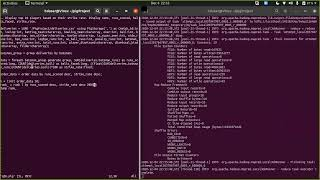
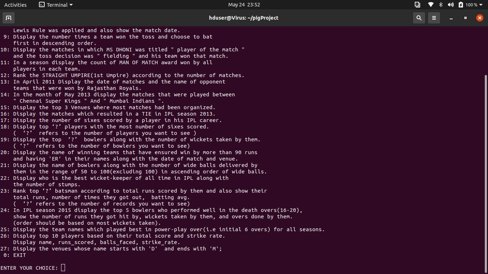
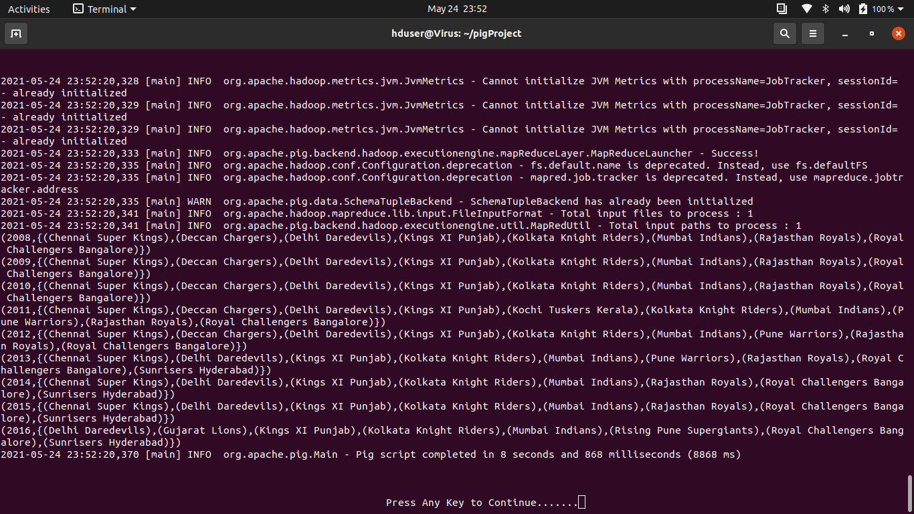

# IPL-MATCHES-ANALYSIS

To do the analysis In this project me and My team has used Apache Pig on top of a Single-Node Hadoop cluster

In this project, we have created several script files which are used to get various insights from the datasets by using Pig scripting Language.

In addition to the Pig scripts, I have created a python program that automates the running of these scripts as some of them require user input so using python it was easy to make the inputs more user-friendly.

## Project Description Video

Team Members

* Lovepreet Singh (Team Leader)
* Madhav Vijay
* Mani Jaswal
* Manmeen Kaur
